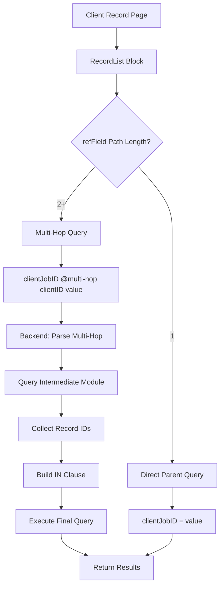

# Grandparent & Great-Grandparent Reference Fields Implementation Plan

## Overview

This plan implements support for grandparent and great-grandparent reference fields in Corteza's RecordList block. Currently, the system supports:
- **Direct parent-child relationships** (e.g., Client Jobs → Client)
- **Sibling/common fields** (e.g., two modules referencing the same parent)

This plan adds support for **multi-hop relationships** (e.g., Client Jobs Submissions → Client Jobs → Client).

## Use Case Example

```
Client Module (Grandparent)
  ↓
Client Jobs Module (Parent/Son)
  ↓
Client Jobs Submissions Module (Grandson)
```

**Goal**: On the Client record page, display a record list showing all Client Jobs Submissions across all Client Jobs for that client.

## Architecture

### Current Query Mechanism

The current backend query mechanism supports direct field value matching:
```
clientJobID = 12345
```

The query string is passed to `filter.WithExpression(f.Query)` in `RecordFilter.ToConstraintedFilter()` (types/record.go:138-149), which is then processed by the DAL layer.

### New Multi-Hop Query Mechanism

We'll introduce a new query syntax for multi-hop filters:
```
@multi-hop(clientJobID, clientID, 12345)
```

This tells the backend:
1. Find all Client Jobs where `clientID = 12345`
2. Get their record IDs
3. Filter Client Jobs Submissions where `clientJobID IN (id1, id2, id3, ...)`

## Implementation Steps

### Phase 1: Backend Query Parser

**File**: `server/compose/types/record.go`

Add a new query operator `@multi-hop` that:
- Parses the multi-hop expression
- Extracts the intermediate field name and target value
- Returns a structured representation for the service layer

```go
// MultiHopFilter represents a multi-hop filter expression
type MultiHopFilter struct {
    FieldName      string // The field in the target module (e.g., "clientJobID")
    IntermediateField string // The field in the intermediate module (e.g., "clientID")
    TargetValue    string // The value to match (e.g., "12345")
}
```

### Phase 2: Backend Service Method

**File**: `server/compose/service/record.go`

Add a new method `FindWithMultiHop` that:
1. Parses multi-hop filters from the query string
2. For each multi-hop filter:
   a. Queries the intermediate module to get matching record IDs
   b. Constructs an IN clause with those IDs
3. Executes the final query with the resolved filters

```go
func (svc record) FindWithMultiHop(ctx context.Context, filter types.RecordFilter) (types.RecordSet, types.RecordFilter, error) {
    // 1. Parse multi-hop filters from filter.Query
    // 2. For each multi-hop filter:
    //    a. Query intermediate module
    //    b. Collect record IDs
    //    c. Build IN clause
    // 3. Execute final query
}
```

### Phase 3: REST API Endpoint

**File**: `server/compose/rest/record.go`

Update the `List` endpoint to:
- Detect multi-hop filters in the query string
- Call the new `FindWithMultiHop` service method
- Return the results

### Phase 4: Frontend Query Builder

**File**: `client/web/compose/src/components/PageBlocks/RecordListBase.vue`

Update the `prepRecordList` method to:
- Detect when `refField` represents a multi-hop path (using `refFieldPath`)
- Generate the appropriate multi-hop query syntax
- Example: `@multi-hop(clientJobID, clientID, ${recordID})`

### Phase 5: Frontend Configurator

**File**: `client/web/compose/src/components/PageBlocks/RecordListConfigurator.vue`

Update the `parentFields` computed property to:
- Include grandparent and great-grandparent fields in the dropdown
- Label them appropriately (e.g., "Client (Grandparent)")

## Detailed Implementation

### Backend: Query Parser

```go
// In server/compose/types/record.go

// ParseMultiHopFilters extracts multi-hop filters from a query string
func ParseMultiHopFilters(query string) ([]MultiHopFilter, string, error) {
    // Parse @multi-hop(fieldName, intermediateField, targetValue) syntax
    // Return:
    // - []MultiHopFilter: list of multi-hop filters
    // - string: remaining query without multi-hop filters
    // - error: any parsing errors
}
```

### Backend: Service Method

```go
// In server/compose/service/record.go

func (svc record) FindWithMultiHop(ctx context.Context, filter types.RecordFilter) (types.RecordSet, types.RecordFilter, error) {
    // 1. Parse multi-hop filters
    multiHopFilters, remainingQuery, err := types.ParseMultiHopFilters(filter.Query)
    if err != nil {
        return nil, filter, err
    }

    // 2. Resolve intermediate record IDs
    resolvedFilters := make(map[string][]uint64)
    for _, mhf := range multiHopFilters {
        // Query intermediate module
        intermediateFilter := types.RecordFilter{
            ModuleID:    mhf.IntermediateModuleID,
            NamespaceID: filter.NamespaceID,
            Query:       fmt.Sprintf("%s = %s", mhf.IntermediateField, mhf.TargetValue),
        }
        
        intermediateRecords, _, err := svc.Find(ctx, intermediateFilter)
        if err != nil {
            return nil, filter, err
        }
        
        // Collect record IDs
        ids := make([]uint64, len(intermediateRecords))
        for i, r := range intermediateRecords {
            ids[i] = r.ID
        }
        
        resolvedFilters[mhf.FieldName] = ids
    }

    // 3. Build final query
    finalQuery := remainingQuery
    for fieldName, ids := range resolvedFilters {
        if len(ids) > 0 {
            idList := make([]string, len(ids))
            for i, id := range ids {
                idList[i] = strconv.FormatUint(id, 10)
            }
            
            inClause := fmt.Sprintf("%s IN (%s)", fieldName, strings.Join(idList, ","))
            if finalQuery != "" {
                finalQuery = fmt.Sprintf("%s AND %s", finalQuery, inClause)
            } else {
                finalQuery = inClause
            }
        }
    }

    // 4. Execute final query
    filter.Query = finalQuery
    return svc.Find(ctx, filter)
}
```

### Frontend: Query Builder

```javascript
// In client/web/compose/src/components/PageBlocks/RecordListBase.vue

// In prepRecordList method, update the refField handling:

if (this.options.refField) {
    if (!this.record) {
        // Skip refField filtering when there's no record
    } else {
        const refFieldName = this.options.refField
        if (this.record.values && this.record.values[refFieldName] !== undefined && this.record.values[refFieldName] !== null) {
            const filterValue = this.record.values[refFieldName]

            if (this.refFieldPath && this.refFieldPath.length > 0) {
                if (this.refFieldPath.length === 1) {
                    // Direct relationship
                    filter.push(`(${this.refFieldPath[0].name} = ${filterValue})`)
                } else {
                    // Multi-hop relationship
                    // Build multi-hop query syntax
                    const intermediateFields = this.refFieldPath.slice(0, -1).map(f => f.name)
                    const targetField = this.refFieldPath[this.refFieldPath.length - 1].name
                    
                    // Example: @multi-hop(clientJobID, clientID, 12345)
                    const multiHopQuery = `@multi-hop(${targetField}, ${intermediateFields.join(',')}, ${filterValue})`
                    filter.push(`(${multiHopQuery})`)
                }
            } else {
                // Direct relationship or common field
                filter.push(`(${this.options.refField} = ${filterValue})`)
            }
        }
    }
}
```

### Frontend: Configurator

```javascript
// In client/web/compose/src/components/PageBlocks/RecordListConfigurator.vue

// In parentFields computed property, update the label for multi-hop fields:

// In the findPathsToTarget function, when adding fields to resultFields:
if (nextModuleID === targetModuleID) {
    // Add all fields in the path plus this field
    const pathLength = currentPath.length
    let label = field.name
    
    if (pathLength === 0) {
        // Direct parent
        label = `${field.name} (Parent)`
    } else if (pathLength === 1) {
        // Grandparent
        label = `${field.name} (Grandparent)`
    } else if (pathLength === 2) {
        // Great-grandparent
        label = `${field.name} (Great-Grandparent)`
    } else {
        // Nth-level ancestor
        label = `${field.name} (${pathLength + 1}-level ancestor)`
    }
    
    resultFields.push(...currentPath.map(f => ({ ...f, isCommonField: false })), {
        ...field,
        isCommonField: false,
        label: label,
    })
    return
}
```

## Testing Plan

### Test Case 1: Grandparent Relationship
1. Create Client module with fields: name, email
2. Create Client Jobs module with fields: title, clientID (Record → Client)
3. Create Client Jobs Submissions module with fields: status, clientJobID (Record → Client Jobs)
4. Create a Client record: "Acme Corp"
5. Create two Client Jobs records: "Job 1", "Job 2" (both linked to "Acme Corp")
6. Create three Client Jobs Submissions records: "Submission 1", "Submission 2", "Submission 3" (linked to "Job 1" and "Job 2")
7. On the Client record page, add a RecordList block for Client Jobs Submissions
8. Configure refField to use the grandparent path
9. Verify that all three submissions are displayed

### Test Case 2: Great-Grandparent Relationship
1. Add a fourth module: "Client Job Tasks" with fields: name, submissionID (Record → Client Jobs Submissions)
2. Create tasks linked to the submissions
3. On the Client record page, add a RecordList block for Client Job Tasks
4. Configure refField to use the great-grandparent path
5. Verify that all tasks are displayed

### Test Case 3: Mixed Relationships
1. On a Client Jobs record page, add a RecordList block for Client Jobs Submissions
2. Configure refField to use the direct parent relationship
3. Verify that only submissions for that specific job are displayed

## Files to Modify

### Backend
1. `server/compose/types/record.go` - Add MultiHopFilter type and parser
2. `server/compose/service/record.go` - Add FindWithMultiHop method
3. `server/compose/rest/record.go` - Update List endpoint

### Frontend
1. `client/web/compose/src/components/PageBlocks/RecordListBase.vue` - Update prepRecordList method
2. `client/web/compose/src/components/PageBlocks/RecordListConfigurator.vue` - Update parentFields computed property

## Mermaid Diagram



## Success Criteria

1. ✅ Grandparent reference fields work correctly
2. ✅ Great-grandparent reference fields work correctly
3. ✅ Direct parent relationships still work
4. ✅ Sibling/common fields still work
5. ✅ Performance is acceptable (no N+1 queries)
6. ✅ Error handling is robust
7. ✅ UI labels are clear and intuitive

## Notes

- The multi-hop query syntax `@multi-hop(field1, field2, ..., value)` is designed to be extensible
- The backend resolves intermediate records in a single query per hop
- The frontend generates the query syntax automatically based on the refFieldPath
- This approach maintains backward compatibility with existing direct and sibling relationships
